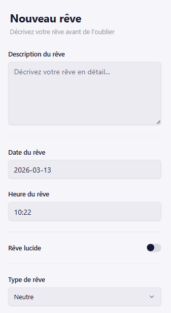
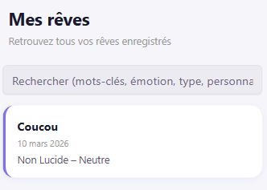
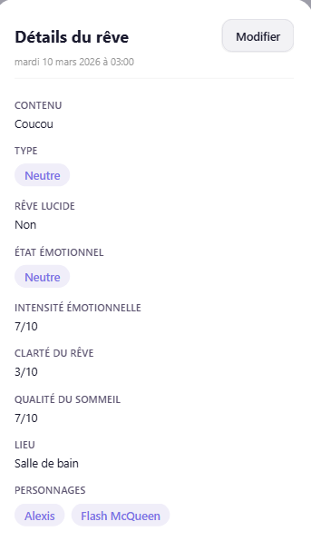
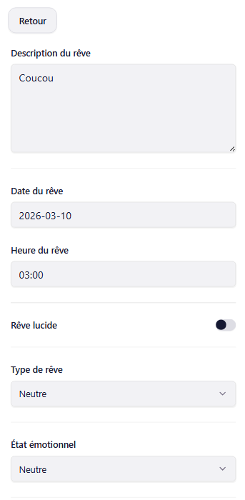

# Projet — Journal de rêves (Expo / React Native)

Application mobile/web permettant d’enregistrer, consulter, rechercher et modifier des rêves. Le projet est construit avec **Expo**, **React Native**, **TypeScript**, **Expo Router** et **NativeWind**.

## Prérequis

- Node.js (LTS recommandé)
- npm (ou yarn/pnpm)
- Expo Go (sur téléphone) si vous testez sur un appareil

## Installation

```bash
npm install
```

## Lancer l’application

### Démarrage (mode développement)

```bash
npx expo start
```

Ensuite, selon votre cible :

- **Web** : appuyez sur `w` dans le terminal, ou lancez :
  ```bash
  npx expo start --web
  ```
- **Android** : appuyez sur `a` (émulateur) ou scannez le QR code avec Expo Go
- **iOS** (macOS uniquement) : appuyez sur `i`

### Nettoyer le cache (utile en cas de comportement étrange)

```bash
npx expo start -c
```

## Structure du projet (vue d’ensemble)

- `app/` : **routing + pages** via Expo Router
  - `app/_layout.tsx` : layout racine
  - `app/(tabs)/` : navigation par onglets
    - `index.tsx` : écran de création (formulaire)
    - `two.tsx` : écran “Mes rêves” (liste + détails + édition)
- `components/` : composants applicatifs
  - `DreamForm.tsx` : formulaire de création/édition de rêve
  - `DreamList.tsx` : liste des rêves, drawer de détails, modal d’édition
  - `components/ui/` : composants UI réutilisables (Button, Input, Select, etc.)
- `types/` : types TypeScript (ex: `Dream.ts`)
- `lib/` : utilitaires (ex: helpers date)
- `assets/` : images et polices
- `constants/` : constantes UI (ex: couleurs)

## Architecture (fonctionnement)

### Données et persistance

- Les rêves sont stockés localement via **AsyncStorage**.
- La clé de stockage utilisée est : `dreamFormDataArray` (tableau JSON de `Dream`).
- Le champ `Dream.date` est une **chaîne ISO** (ex: `2026-03-13T21:15:00.000Z`).
  - La date ET l’heure sont combinées lors de la sauvegarde.

### Écrans et flux

- **Créer un rêve** : onglet principal (formulaire)
- **Consulter** : onglet “Mes rêves” (liste)
- **Détails** : ouverture d’un drawer depuis la liste
- **Modifier** : bouton “Modifier” dans le drawer → ouverture d’une modal contenant `DreamForm` pré-rempli

## Choix de conception (UI/UX)

- **NativeWind / Tailwind** pour une mise en page rapide et cohérente.
- **Composants UI** dédiés dans `components/ui/` pour éviter de dupliquer les styles (inputs, boutons, select…).
- **Drawer de détails** pour consulter un rêve sans quitter la liste.
- **Modal d’édition** animée : ouverture/fermeture en **slide depuis la droite**.

## Fonctionnalités implémentées

- Création d’un rêve avec :
  - description
  - date + **heure** (champ séparé)
  - type de rêve (rêve / cauchemar / neutre)
  - rêve lucide
  - état émotionnel + intensité
  - lieu, clarté, qualité du sommeil
  - personnages, mots-clés
  - signification personnelle
- Liste des rêves :
  - affichage sous forme de cartes
  - ouverture d’un drawer de détails
- Recherche / filtrage dans la liste :
  - recherche par texte, mots-clés, émotion, type de rêve, personnages
- Édition d’un rêve existant :
  - pré-remplissage du formulaire
  - mise à jour par `id` en persistance

## Captures d’écran (à compléter)

Ajoutez vos captures dans un dossier (par ex. `docs/screenshots/`) puis remplacez les liens ci-dessous.

> Liens factices : remplacez `URL_A_REMPLACER` par le chemin/URL réel de vos images.

1. **Écran “Nouveau rêve” (formulaire)**
   

2. **Écran “Mes rêves” (liste)**
   

3. **Drawer “Détails du rêve”**
   

4. **Modal “Modifier” (slide depuis la droite)**
   
